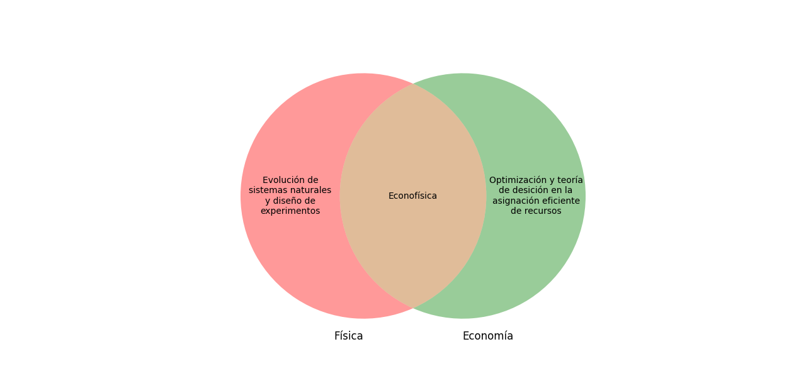
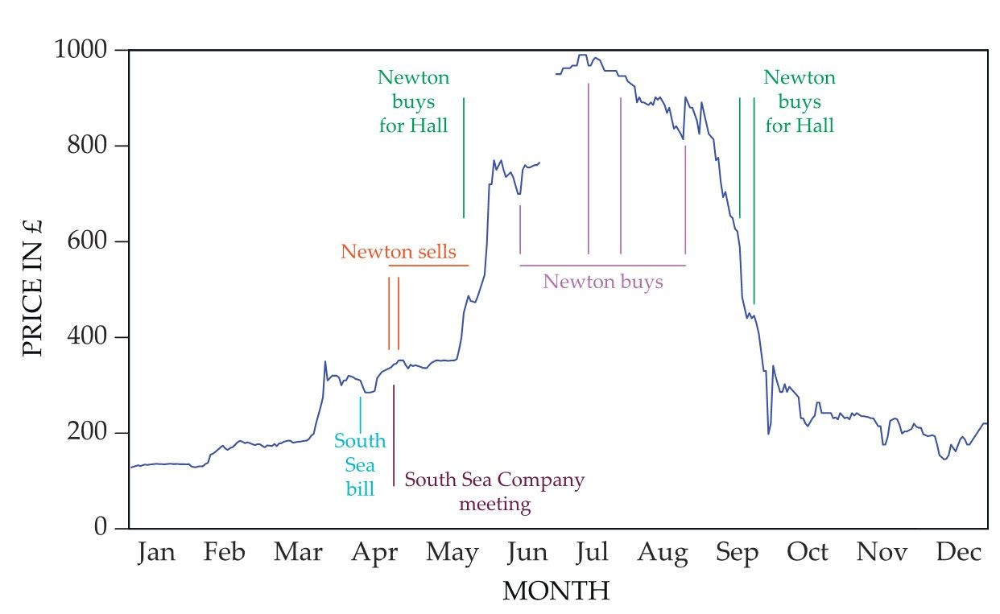
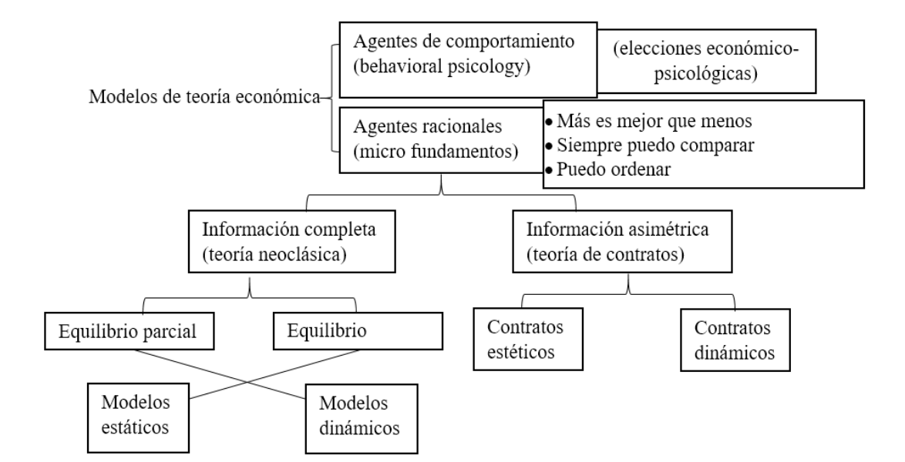
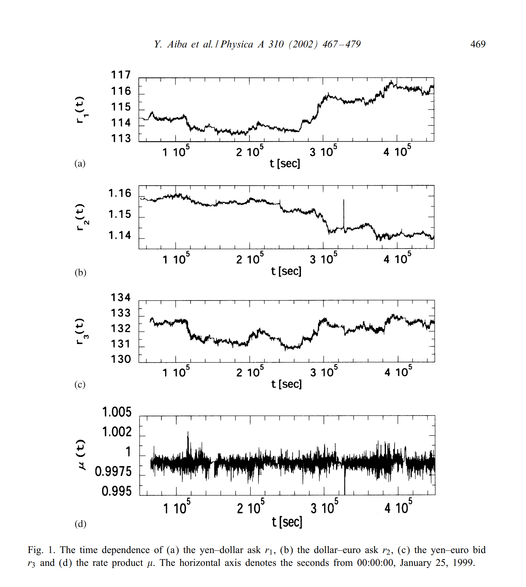
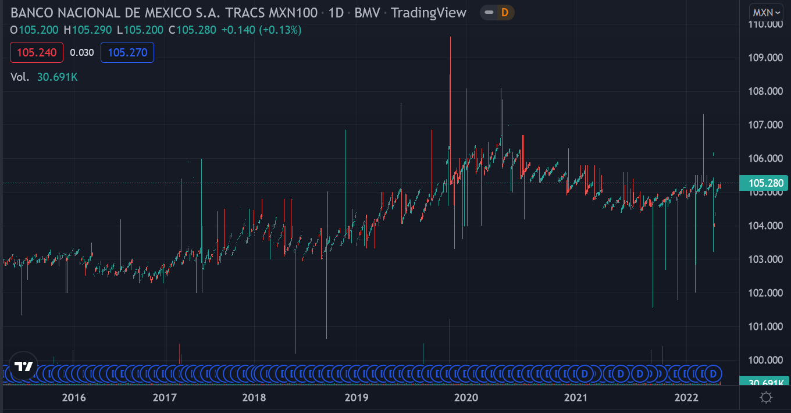
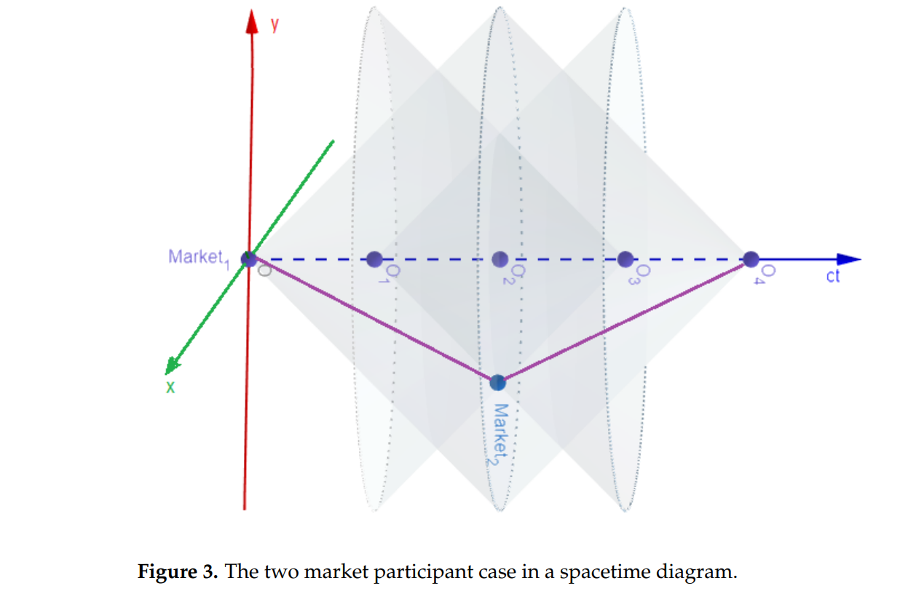

```{r setup, include=FALSE}
knitr::opts_chunk$set(echo = FALSE)
library(kableExtra)
```

## Introducción



La econofísica (hasta ahora) sólo tiene sentido para la solución de problemas de origen económico.

Dependiendo del problema, la econofísica se puede clasificar como:

- **Trasdisciplinaria**: Conceptos de física se aplican como analogías para entender y modelar un fenómeno económico pero no existe el concepto en economía ni su equivalente.

Ejemplo: Considerar el nivel de riqueza de una empresa como la energía de la misma.

- **Interdisciplinaria**: Herramientas y modelos de física se ajustan para la solución del problema.

Ejemplo: Movimiento Browniano en la ecuación de Black-Scholes.

- **Multidisciplinaria**: Físicos y economistas trabajan en conjunto en su área para la solución de un problema.

Ejemplo: Teoría de fluidos aplicado al tráfico en un área urbana.

<br/><br/>
<br/><br/>

**¿Desde cuándo es interesante para un físico estudiar economía?**

{width=50%}


<br/><br/>


**Un poco de economía**

La economía surge a partir de la obra de Adam Smith "La riqueza de las naciones" en marzo de 1776, mientras que la econofísica es mencionada por primera vez por Stanley et al (1996).


{width=90%}


## Arbitraje triangular

<br/><br/>

Arbitraje: Oportunidad de rendimiento monetario positivo **instantáneo sin riesgo**.

```{r}
currency = c("USD Dollar", "Japanese Yen", "Euro")
DiagrammeR::grViz("
  digraph graph2 {
  
    graph [layout = dot, rankdir = LR]
    
    node [shape = oval]
    a [label = '@@1']
    b [label = '@@2']
    c [label = '@@3']
    
    a -> c -> b -> a
  }
  
  [1]: currency[1]
  [2]: currency[2]
  [3]: currency[3]
  ",
  height = 500)
```


Para cuantificar el arbitraje triangular definimos:

$$\mu(t) = \prod_{i=1}^{3}r_i(t)$$

Donde  $r_i(t)$ denota el tipo de cambio en el tiempo $t$. Para este caso:

- $r_1(t) = \frac{1}{yen-dollar}: Ask$
- $r_2(t) = \frac{1}{dollar-euro}: Ask$
- $r_3(t) = yen-euro: Bid$

y $\bar{\mu} = 0.99998$, existe arbitraje si $\mu > 1$.

{width=90%}

```{r}
price = data.frame(
  "Bid" = c(124.41, 136.54, 1.09),
  "Spread" = c(0.06, 0.06, 0.01),
  "Ask" = c(124.47, 136.60, 1.10)
)
rownames(price) = c("Dollar - Yen", "Euro - Yen", "Euro - Dollar")
price %>%
    kbl(caption = "Tipo de cambio hipotético (Sin arbitraje)") %>%
    kable_classic(full_width = F, html_font = "Cambria")
```

<br/><br/>

$1$ Yen -> $\frac{1}{124.47} = 0.00803$ Dollar

$0.00803$ Dollar -> $0.00803*\frac{1}{1.1} = 0.00730$ Euro

$0.00730$ Euro -> $0.0073*136.54 = 0.99772$ Yen

$$\mu = 0.99772$$

<br/><br/>

```{r}
price = data.frame(
  "Bid" = c(124.41, 136.54, 1.08),
  "Spread" = c(0.06, 0.06, 0.01),
  "Ask" = c(124.47, 136.60, 1.09)
)
rownames(price) = c("Dollar - Yen", "Euro - Yen", "Euro - Dollar")
price %>%
    kbl(caption = "Tipo de cambio hipotético (Con arbitraje)") %>%
    kable_classic(full_width = F, html_font = "Cambria")
```

<br/><br/>

$1$ Yen -> $\frac{1}{124.47} = 0.00803$ Dollar

$0.00803$ Dollar -> $0.00803*\frac{1}{1.09} = 0.00737$ Euro

$0.00737$ Euro -> $0.00737*136.54 = 1.00639$ Yen

$$\mu = 1.00639$$

Modelo del tipo de cambio en el siguiente instante 
$$ln(r_i(t+\Delta t)) = ln(r_i(t)) + g(\nu(t)) + e_i(t)$$
Donde $\nu(t) = ln(\mu(t)) = \sum_{i=1}^3 ln(r_i(t))$ es la interacción con los otros mercados y $e_i(t)$ es una fluctuacción independiente (error).

La ecuación anterior puede ser explicada por una caminata aleatoria de tres partículas conectadas por resortes, donde $ln(r_i)$ se puede determinar como la posición de las partículas.

El centro de gravedad es determinado por la fuerza neta de los resortes $g(\nu(t))$ debe ser negativa para $\nu > \bar{\nu}$ y positiva para $\nu < \bar{\nu}$, entonces tiene la forma $g(\nu(t)) = -a(\nu - \bar{\nu})$; $a>0$ es la fuerza de la interacción.

{width=90%}

## Tasa de interés relativista

Los modelos de economía y finanzas mantienen al tiempo como una unidad fundamental para modelos de valuación.

En principio, se pueden estudiar todos los fenómenos financieros desde un punto de vista de teoría de contratos.

Las variables principales de un contrato son monto $M$, plazo $T$ y tasa de interés $r$ definidas en los reales (excepto por $T\in\mathbb{R^+}$) y el estudio principal del contrato $\Lambda = \{M, T, r\}$ se basa en la valuación en cada momento.


**Bono**

Supongamos que existe un contrato de bono que paga una tasa anual del $r=5\%$ durante $T=5$ años. Si el contrato es por $M=100,000$.

```{r}
x = seq(1, 1825)
M = c(100000)
r = 0.05


n = 1
day = 1
for (i in x) {
  M[i+1] = 100000*(1 + r/365 * day)
  day = day + 1
  if(i == 365*n){
    n = n + 1
    day = 1
    M[i+1] = M[i+1] - 5000
  }
}

plot(M, type = 'l', ylab = 'M', xlab = 'T (Días)')
```


{width=90%}


Los flujos de efectivo son:

- Año 0: $-\$100,000$
- Año 1: $\$5,000$
- Año 2: $\$5,000$
- Año 3: $\$5,000$
- Año 4: $\$5,000$
- Año 5: $\$105,000$

Al final de los 5 años se obtiene $\$25,000$.

**Efectos de relatividad**

Supongamos dos participantes de mercado (observadores) $MP, MP'$ y dos marcos de referencia inerciales $L=(ct, x, y, z), L'=(ct', x', y', z')$ donde $L'$ se aleja de $L$ a velocidad $v$. Las transformaciones de Lorentz:

$$ct'= \gamma (ct - \frac{v}{c} x), \quad x'= \gamma (x-vt), \quad y'= y, \quad z'= z$$

donde $\gamma = \frac{1}{\sqrt{1-\frac{v^2}{c^2}}}$ es el factor de Lorentz.

Un activo puede ser valuado por $MP$ en $P_{t1} \neq P_{t'1}$ en el instante $t1$. Para ser posible una transacción entre ambos participantes se requiere del tiempo propio:

$$\Delta \tau = \sqrt{(t_f - t_i)^2- \frac{(x_f - x_i)^2}{c^2}} \quad \Delta \tau' = \sqrt{(t'_f - t'_i)^2- \frac{(x'_f - x'_i)^2}{c^2}}$$


Y $\Delta \tau = \Delta \tau'$


{width=90%}


En el diagrama anterior sucede lo siguiente:

- En el punto $O$ ambos observadores valúan el contrato igual ($mercado_1$).
- $MP'$ empieza a alejarse en dirección al $mercado_2$ (en el eje x)
- $MP$ llega al punto $O_2$ en $T$
- $MP'$ llega a $mercado_2$ y observa simultáneamente a $MP$ en el punto $O_1$
- El tiempo transcurrido en el $mercado_2$ es $\frac{T}{\gamma} < T$
- $MP'$ regresa en dirección al $mercado_1$ para encontrarse en el punto $O_4$
- $MP$ observa $2\frac{T}{\gamma}$ mientras que $MP'$ observa $2T$
- Se vuelva a valuar el activo (lo valúan igual) y $MP'$ incurre en las mismas ganancias (pérdidas) en un lapso de tiempo más corto, pero en el mismo tiempo propio.


Lo anterior implica que en el caso de un bono, la estructura de contrato no se mantiene ya que en un menor tiempo te asigan los mismo flujos, lo cual implica una tasa de interés diferente.


Para que funcionen los mercados se requieren dos axiomas:

- Para todos lo eventos financieros y participantes de mercado, cuando se involucran diferentes sistemas de referencia inerciales, un marco de referencia acordado debe ser considerado a priori como referencia.

- Cuando solo el tiempo incorpora efectos relativistas, el tiempo propio mantiene invariante la valuación del activo en todos los marcos de referencia. Todos los participantes de mercado deben mantener la misma valuación utilizando el tiempo propio.


## Conclusiones

- Mientras que la econofísica es estudiada principalmente por físicos, las reglas de economía deben ser utilizadas sin distorciones importantes para evaluar un modelo con respecto de datos reales.

- La economía mantiene relaciones cercanas a conceptos físicos (el espacio geográfico y el tiempo son métricas de la naturaleza) y no pueden despegarse de la realidad. Sin embargo, existen conceptos abstractos en la economía (como la riqueza) que aunque se encuentran atados a un valor monetario, pueden fluctuar por perpectivas positivas o negativas.

- La importancia de la econofísica se encuentra en las aplicaciones y soluciones a problemas de economía.


## Referencias

- Physics Today 73, 7, 30 (2020); https://doi.org/10.1063/PT.3.4521

- Y. Aiba, N. Hatano, H. Takayasu, K. Marumo, T. Shimizu, Triangular arbitrage as an interaction among foreign exchange rates, Physica A: Statistical Mechanics and its Applications (2002)

- Aiba, Y., Hatano, N., Takayasu, H., Marumo, K., Shimizu, T. (2004). Triangular Arbitrage in the Foreign Exchange Market. In: Takayasu, H. (eds) The Application of Econophysics. Springer

- Richmond, P., Mimkes, J., & Hutzler, S. (2013-09-01). Econophysics and Physical Economics. : Oxford University Press

- Carvalho, V. H., & Gaspar, R. M. (2021). Relativistic Option Pricing. International Journal of Financial Studies, 9(2), 32.

- J. Moreno, A. Narváez (2016). Microeconomía Intermedia con Aplicaciones 1º Edición
